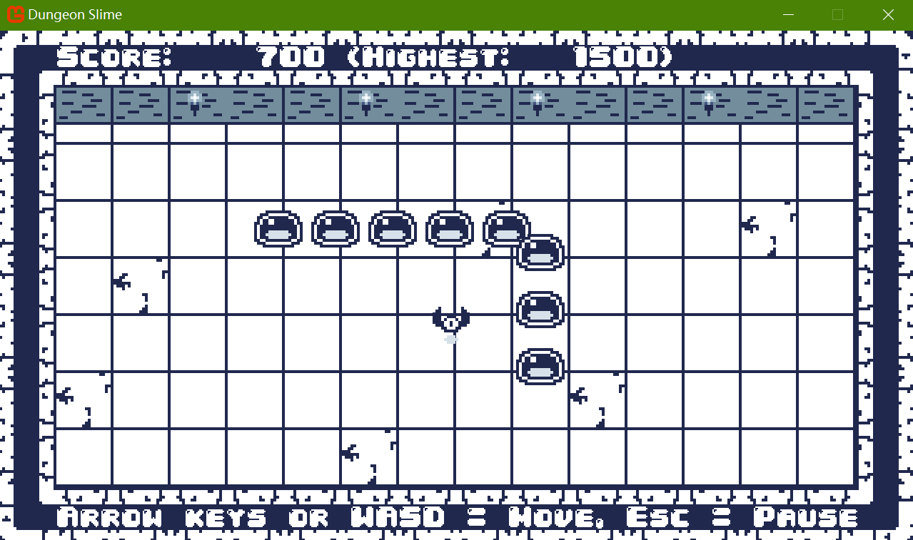

# Dungeon Slime (Modified by Pac-Dessert1436)



## Description
This project is a Snake-inspired 2D dungeon game built with **C# & MonoGame** (Desktop GL project, Windows-compatible), adapted from the MonoGame 2D tutorial with some custom tweaks. Started as a MonoGame tutorial demo, it is reimagined with Snake-like gameplay:
- You control a **lead slime** that spawns at the center of the dungeon, moving right by default.
- A single bat flies randomly around the dungeon. Collect it, and a new slime will join your trailing "snake" of slimes.
- The game progresses as your slime trail grows longer (more bats collected).
- **Game Over Triggers**: The lead slime hits dungeon walls, or collides with any slime in the trailing group.

## Modified Content
This version builds on the original MonoGame 2D tutorial project with these custom tweaks:
- **Highest Score Tracking**: Displays current score and the highest score of the current game session. Persistent high score saving functionality is now implemented in `GameMain.cs`.
- **Bottom Operation Hints**: Persistent on-screen message (i.e., "Arrow Keys or WASD = Move, Esc = Pause") for player guidance.

## How to Play

### Setup & Run
1. **Prerequisites** (install first):
   - [.NET SDK 8.0+](https://dotnet.microsoft.com/download/dotnet/8.0) (required for C# & MonoGame)
   - Install MonoGame templates via CLI:
     ```bash
     dotnet new install MonoGame.Templates.CSharp
     ```
2. Get the project:
   ```bash
   # Clone the repo
   git clone https://github.com/Pac-Dessert1436/DungeonSlime
   # Navigate to the project folder
   cd DungeonSlime
   ```
3. Run the game:
   - Open `DungeonSlime.sln` in Visual Studio (or Rider/VS Code with C# extensions), then build & run.
   - Alternatively, run the project directly via terminal:
     ```bash
     dotnet run
     ```
### Controls
- **Movement**: Arrow Keys or WASD
- **Pause Game**: ESC Key
- **Game Over Screen**:
  - Select `Retry` to start a new game
  - Select `Quit` to exit the game

## Personal Notes
Working on this MonoGame project has been a tough learning experience for my part. The framework's APIs still feel unfamiliar to me, much like walking into my Postgraduate Entrance Exam this year, unable to recall the knowledge I should have memorized. I'm still at the very beginning of learning game development with MonoGame, and this process has reinforced a key lesson: whether I end up working in traditional Chinese medicine (TCM) or other walks of life, or just stick to coding as a hobby of mine, there are no shortcuts to mastery. Consistent learning and practice are the only paths forward for countless aspects of life.

## License
This project is licensed under the MIT License. See the [LICENSE](LICENSE) file for details.